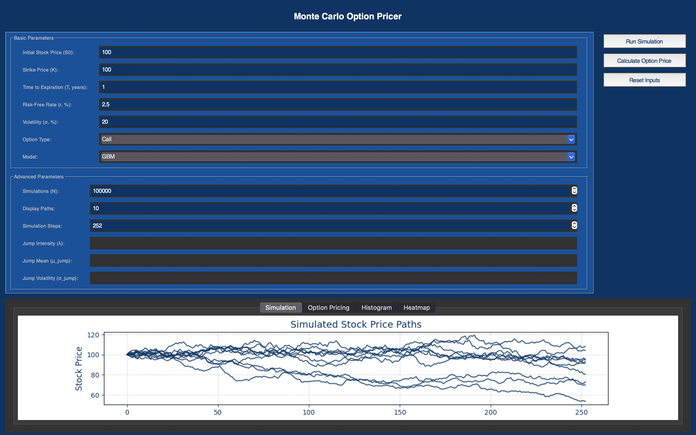

# Monte Carlo 

Welcome to the **Monte Carlo Option Pricer** – a Python-based GUI application designed to simulate and price options using Monte Carlo methods. 

## Table of Contents

- [Overview](#overview)
- [Features](#features)
- [Screenshot](#screenshot)
- [Installation](#installation)

## Overview

The Monte Carlo Option Pricer uses simulation techniques to estimate the price of European-style options. It supports multiple models, including:

- **Geometric Brownian Motion (GBM):** The standard model for simulating stock prices. The GBM model assumes that prices follow a log-normal distribution.
    - **dSₜ** = μ Sₜ dt + σ Sₜ dWₜ
    - **Sₜ** = Stock price at time t
    - **μ** = Expected return (drift term)
    - **σ** = Volatility (standard deviation of returns)
    - **dWₜ** = Wiener process (Brownian motion)

- **Jump Diffusion Model:** Incorporates sudden jumps, capturing events like earnings surprises or market shocks.
    - **dSₜ** = μ Sₜ dt + σ Sₜ dWₜ + Jₜ dNₜ
    - **Jₜ** = Jump size (log-normally distributed)
    - **dNₜ** = Poisson-distributed jump occurrences

- **Built with:**
    - **Tkinter:** Interactive GUI
    - **Matplotlib:** Visualizations (Histograms, Heatmaps, Simulations)
    - **NumPy:** Fast numerical calculations

## Features

- **Interactive GUI:** User-friendly input with tooltips and themed styling.
- **Real-time Simulations:** Visualize simulated stock price paths.
- **Option Pricing:** Calculate call/put option prices with confidence intervals.
- **Distribution Analysis:** View histograms of the final stock prices.
- **Heatmap Visualization:** Examine the density of stock prices over time.
- **Customizable Parameters:** Adjust simulations, jump diffusion parameters, and more.
- **Save Plots:** Save your simulation plots for reporting or further analysis.

## Screenshot

Below is a preview of the Monte Carlo Option Pricer in action:


## Installation

Ensure you have Python 3.7 or above installed. Then, install the required packages using pip:

```bash
pip install numpy matplotlib tk
